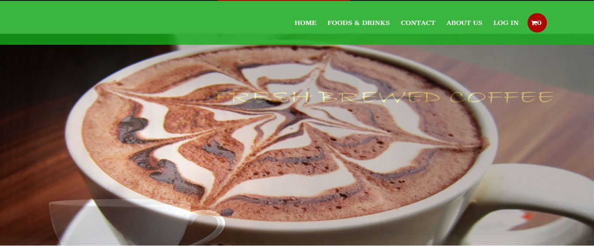

# **Capestone - Angular**

Capestone - Angular is an Online Cafe website, built using Angular JS, where users can see the available fast food items along with the items details and price. Users can order multiple items by adding the items to their cart and later can do the payment using PAYPAL.

## Table of Content
* [Features](#Features)
* [Prerequiste](#Prerequiste)
* [Installation](#Installation)

## Features
* It displays various available food items along details and price
* Users can sign up and login
* It includes all the CRUD operations for the food items and user profile update based on authentication of the user
* User authentication and authorization using Angular Role Guard
* Users can add items to the cart
* Sending emails to and from the users
* Payment can be done using PayPal

## Prerequiste
* 

## Installation

Make sure you have **[Angular JS](https://cli.angular.io/)** and **[git](https://git-scm.com/book/en/v2/Getting-Started-Installing-Git)** installed on your machine.

Open the terminal and follow the steps
* Step 1 : Clone the repo

         git clone https://github.com/maftab5/capestone-angular.git
 
 You can see `Capestone-angular` folder in your current working directory. Now change the direcotry to **`Capestone-angular`** 
 
 * Step 2 : Install dependencies
 
          npm install
 
 This will install all the dependencies for the project.
 
 * Step 3 : Run the project.
 
          npm start
 
 You should see the project up and running
